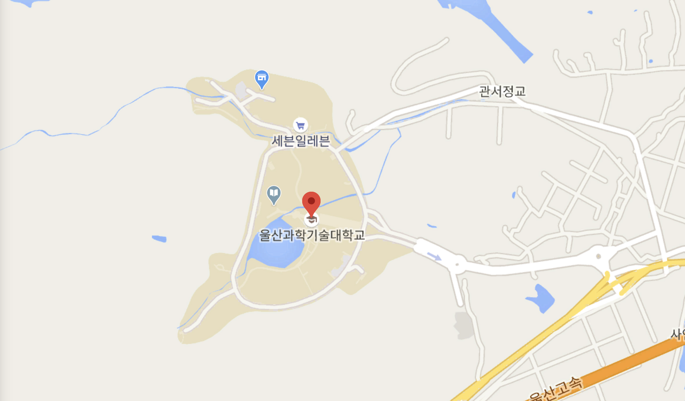
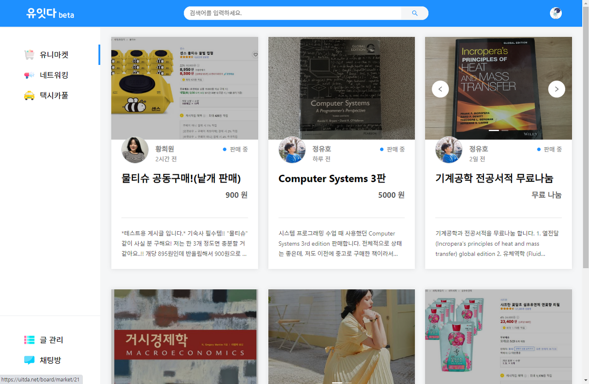
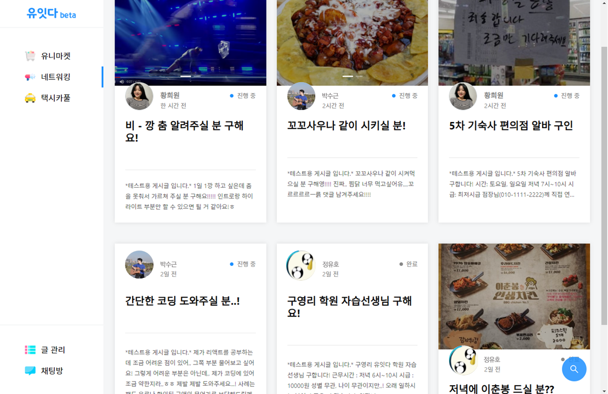
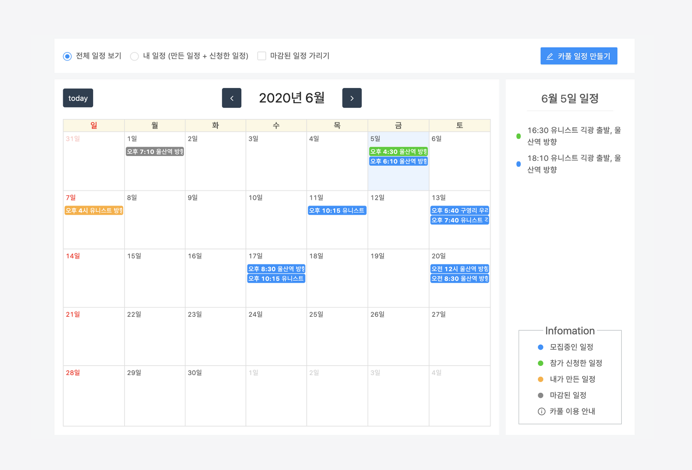
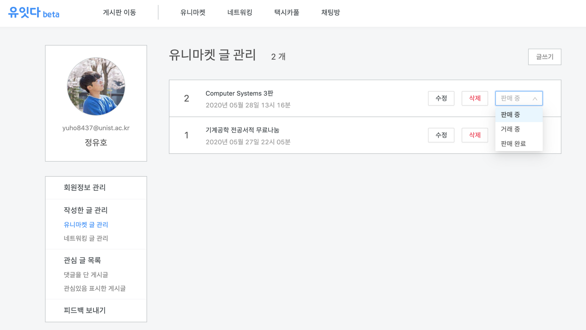
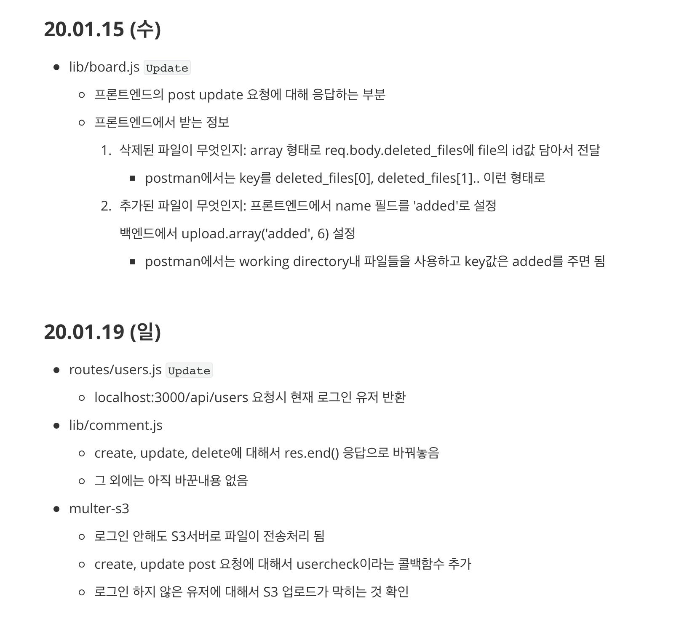

## 유잇다 소개

프로젝트를 마무리하게 된 이 시점에서 1년 반 동안의 기록을 아래에 적어보려고 합니다.

### 프로젝트의 시작

프로젝트의 이름은 '유잇다'입니다. 저희가 현재 재학중인 유니스트의 학생들을 웹 서비스를 통해 연결해보겠다는 의미에서 제작된 이름입니다.  

유니스트는 대부분의 학생들이 기숙사에 입주하여 살고있는 학교입니다. 캠퍼스는 산 속에 위치하고 있어 공기가 좋고 조용해서 공부하기엔 좋은 학교지만, 걸어서 갈 수 있는 마트나 외부 음식점이 거의 없는 것은 물론, 시내를 나가려면 버스로 40분 정도가 걸릴 정도로 외부와 단절이 되어있는 학교입니다. 

음식이나 생필품을 구매할 곳이 마땅히 없으니 어쩔 수 없이 택배나 편의점에 의존하는 비합리적 소비가 자주 이루어집니다. 이를 해결하고자 학생들은 교내 페이스북 그룹을 통해서 중고 서적과 물품을 구매하거나 배달 음식을 같이 주문하고, 택시 카풀을 자주 하곤 합니다. 하지만 페이스북 그룹을 통해 이루어지는 거래나 소통은 직관적이지 않으며, 게시글이 시간순으로 출력되지 않는 점이나 한 화면에 하나의 게시글만 보이는 점 등, 몇 가지 불편한 점이 존재했습니다.

그래서 저희 팀은 학생들이 페이스북에서 유용하게 사용하던 서비스들의 문제점을 개선하고 이를 독립된 웹/앱에서 직관적인 UI로 제공해 보자는 생각에 이 프로젝트를 시작하게 되었습니다. 

### 베타 서비스

 ~~이 [링크](https://uitda.net/)를 통해 직접 유잇다 웹 서비스를 확인하실 수 있습니다.~~ (AWS 프리티어가 2020년 7월 까지인지라 지금은 막혀있습니다)

 서비스는 크게 '유니마켓 / 네트워킹 / 택시카풀'로 이루어져 있습니다. 유니마켓 카테고리에서는 학생들 사이에 물건 판매, 중고물품 거래가 이루어집니다. 판매자는 자신의 남는 생활용품, 사이즈가 맞지 않는 옷, 전공 서적 등 잉여물품을 판매하여 소득을 창출 할 수 있으며 구매자는 저렴한 가격에 제품을 구매하여 절약을 할 수 있습니다.

 네트워킹 카테고리는 학생들의 연결고리 역할을 합니다. 배달음식 주문, 구매 대행 부탁, 연구실 피실험자 모집, 스터디원 모집 등 다양한 퀘스트와 보상을 함께 제시하여 학생들이 교내 물적, 인적 자원을 최대로 활용할 수 있도록 돕습니다.

 택시카풀 카테고리에서는 같은 방향으로 이동하는 학생들의 카풀이 이루어집니다. 지리적 요건 때문에 많은 학생들의 교외 이동경로가 거의 일치합니다. 그렇기 때문에 같은 방향으로 이동하는 학생들이 많고, 이런 학생들이 카풀을 통해 저렴한 가격에 택시 승차를 할 수 있습니다.

 이 외에도 글 관리, 피드백 보내기 같은 페이지도 구현하여 기본적인 웹 서비스의 형태를 갖추도록 개발하였습니다. 

### 백엔드 개발 기록

 팀원 총 세 명이서 개발을 하였고, 한 명은 프론트엔드, 나머지 두 명은 백엔드와 서버, DB를 맡아서 개발하였습니다. 전체적인 개발 스펙은 아래와 같습니다. 

- Framework: React (frontend), Node-Express.js (backend)
- Library & Modules: FullCalendar, ant.design, socket.io, Passport.js-outlook, S3-multer... etc.
- Database: MySQL, Sequilize.js (backend)
- Server: AWS EC2 with Nginx, AWS S3, AWS route53
- Postman, Github

 프로젝트를 시작한건 2019년 2월이지만 당시에는 HTML, CSS가 뭔지도 몰랐기 때문에 실제로는 9월 정도가 되어서야 본격적으로 작업을 시작했습니다. 학교 수업과 병행하여 HTML, CSS를 공부하기 시작했고, 이 둘을 모두 공부한 뒤에는 javascript와 Node.js를 공부했습니다. 아마 Node.js까지 공부를 하고나니 5월이 지나있었던 걸로 기억합니다. 그리고 7월 즈음에는 Express와 AWS까지 공부를 완료 했습니다. 

 9월부터는 실제로 서비스를 위한 코드를 작성하기 시작했고, 작업한 내용과 작업 할 내용들은 위의 사진처럼 개인 마크다운 파일에 날짜 별로 기록하며 팀원들과 피드백을 주고받았습니다. 작업을 하면서 막히는 부분들에 대해서는 그때그때 공부하면서 해결했습니다. 9월 이전까지는 세 팀원이 모두 같은 내용에 대해서 공부했다면, 9월 이후부터는 프론트엔드, 백엔드로 나누어서 각자 맡은 작업을 중점적으로 공부하고 개발했습니다.

프로젝트의 완료 시점까지 특별한 로드맵을 설정해 둔게 아니라 그때마다 요구되는 내용에 대해서 공부했기 때문에, 이런식으로 공부하고 개발하고를 계속해서 반복하다 보니 지금의 웹 서비스가 완성되었습니다. 이런 과정을 거치다보니까 해야할 일이 무엇인지 알고 스스로 목표를 설정하는게 중요하구나라는 생각이 들었습니다. 그리고 혼자 공부하는 것 보다 같이 공부하는게 더 빠르고 정확하게 공부하는 방법이라는걸 많이 체감했습니다.

### 후기

 프로젝트를 처음 기획하는 단계에서는 고파스나 스누라이프 같은 교내 웹 커뮤니티 사이트를 만들려고했습니다. 이후 회의를 거치면서 1년이라는 기간 내에 우리가 어느 정도까지 구현할 수 있는지에 대해 객관적으로 판단해보고, 이 수준에서 가장 최선의 효과를 낼 수 있는 서비스가 무엇일까를 고민하는 과정에서 지금의 웹 서비스 형태가 되었습니다. 

 단순히 프로젝트를 넘어서 비즈니스 모델까지 구상하는 시간도 가졌었는데, 이 서비스가 웹 뿐만 아니라 앱의 형태로도 제작된다면 충분히 좋은 서비스로 발전할 수 있다는 생각이 들었습니다. 같은 집단에 속해있는 구성원 간의 중고거래, 구인구직, 카풀은 충분히 니즈가 존재할 것이라는 생각이 들었고, 유니스트 뿐만이 아닌 여러 대학이나 회사같은 집단으로 확대될 수 있겠다고 생각했습니다. 다만, 그러기에는 팀원들의 군대 & 대학원 입학 이슈... 때문에 현실적으로는 웹을 끝내는 것을 목표로 잡았습니다.

혹여나 다음 번에 또 웹 개발을 하게 된다면 부가적으로 공부해보고 싶은 것들을 아래에 적고 글을 마칩니다

> serverless, socket-chatting, Typescript, 동기/비동기 RESTful API, NoSQL